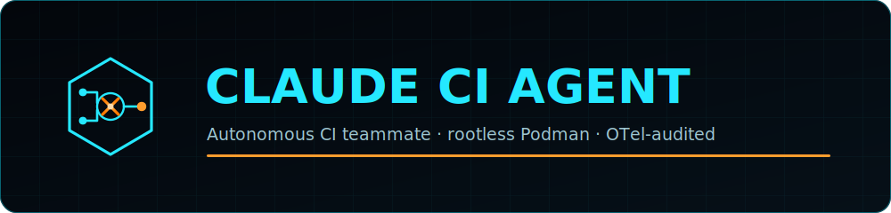

<p align="center">
  
</p>

<p align="center">
  <a href="https://github.com/bigg01/claude-ci-agent/actions/workflows/docs.yml"></a>
  <a href="https://github.com/bigg01/claude-ci-agent/actions/workflows/claude-agent.yml"></a>
  <a href="LICENSE"></a>
</p>

<p align="center">
  
  
  
  
  <a href="https://zensical.org"></a>
</p>

An autonomous engineering teammate that runs inside a **rootless, unprivileged
Podman sandbox**. Every action is captured, scrubbed for secrets, and streamed to
Elastic via an OpenTelemetry (OTel) Collector sidecar at `http://localhost:4318`.

The agent runs in two CI flavors— **GitLab CI** and **GitHub Actions**— and
detects which one it is in via `$GITLAB_CI` / `$GITHUB_ACTIONS`. The same rootless
image deploys unchanged on **OpenShift** and **AKS** (see [`deploy/`](deploy/)).

### 📖 [Read the full documentation →](https://bigg01.containerize.ch/claude-ci-agent/)

This README is a summary; the complete docs (architecture, spec-driven development,
CI setup, sandboxing, observability, Kubernetes/Helm, and more) live on the
**[documentation site](https://bigg01.containerize.ch/claude-ci-agent/)**.

Reusable across repos as a [GitLab component](templates/claude-agent.yml)
(`include: component:`) and an equivalent [GitHub Action](action.yml)
(`uses: bigg01/claude-ci-agent@v1`).

> Operating guide for the agent itself lives in [`CLAUDE.MD`](CLAUDE.MD).
>
> **Where this repo lives:** developed on **GitHub** — all CI runs in
> [`.github/workflows/`](.github/workflows/) — and mirrored read-only to
> **GitLab**, where the only pipeline is a tagged release that publishes the
> [component](templates/claude-agent.yml) to the CI/CD Catalog. There is no
> agent/test pipeline on the GitLab side.

## Two ways to run it

Pick your path— both run the same rootless, OTel-audited sandbox:

| | What it is | Start here |
| --- | --- | --- |
| **🔁 In CI** | The agent runs in your pipeline— an *advisor* that reviews MRs/PRs, or an *agent* that applies a fix and opens a new branch. Triggered by pipelines and `@claude` comments. | [CI versions](#ci-versions) · GitLab [component](templates/claude-agent.yml) · GitHub [action](action.yml) / [`.github/workflows/`](.github/workflows/) |
| **☸️ Deployed on Kubernetes** | The same image runs as a **Job on OpenShift or AKS**— one image satisfies arbitrary-UID injection and the `restricted` Pod Security Standard. | [Deploying on Kubernetes](#deploying-on-kubernetes-openshift--aks) · [`deploy/`](deploy/) |

## Requirements

- [uv](https://docs.astral.sh/uv/)— Python package & environment management
- [Podman](https://podman.io/)— rootless container builds (do **not** use Docker)

## Quick start

```bash
make install      # sync Python deps (incl. Zensical) via uv
make serve        # live-preview the docs at http://localhost:8000
make build        # build the container image (app-test) with Podman
```

Run `make help` to list all targets.

## Make targets

| Target | Description |
| --- | --- |
| `make install` | Sync Python deps (incl. Zensical) into the uv environment |
| `make serve` | Live-preview the docs at `http://localhost:8000` |
| `make docs-build` (`make docs`) | Build the static docs site into `site/` |
| `make docs-clean` | Remove the built docs site |
| `make build` | Build the container image (`app-test`) from `Containerfile` |
| `make run` | Run the built image as a detached `test-service` |
| `make test` | Run the pytest suite (unit tests + config validation) |
| `make test-e2e` | Run the container end-to-end test locally (`SKIP_BUILD=1` to reuse the image) |
| `make ci-local` | Local CI test: bring up the stack + telemetry e2e into Elasticsearch |
| `make stack-up` / `make stack-down` | Start / stop the local stack (Elasticsearch + Kibana + OTel) |
| `make compose-build` | Build the agent image via the compose file |
| `make dashboard` | Create Kibana data views for `claude-agent-*` |
| `make clean` | Remove `site/` and the container image |

The container engine defaults to `podman`; override with
`make build CONTAINER_ENGINE=docker`. Image name and Containerfile are also
configurable via `IMAGE` and `CONTAINERFILE`.

## Testing

**Unit + config tests (`make test`).** A fast [pytest](tests/) suite— no
containers— covering the OTLP cost emitter ([`otel/emit_cost.py`](otel/emit_cost.py))
and static validation of the configs and manifests (`zensical.toml`, the GitLab
component, the k8s manifests, and `compose.yaml`). It runs in CI via
[`.github/workflows/ci.yml`](.github/workflows/ci.yml) (`uv run pytest`, JUnit
report uploaded) and gates everything downstream.

```bash
make test     # uv run pytest
```

**End-to-end test (`make test-e2e`).** [`tests/e2e.sh`](tests/e2e.sh) runs **locally
first**, then unchanged in CI. It runs five fail-fast stages:

1. **Validate configs**— Zensical docs build, plus `zensical.toml` / GitLab component parse checks
2. **Build image**— `podman build` of the rootless sandbox (`SKIP_BUILD=1` reuses an existing image)
3. **Toolchain & connectivity smoke**— confirms `claude` / `node` / `podman` are present and that outbound HTTPS egress works (`curl ipinfo.io`; skip with `SKIP_NET=1`)
4. **Sandbox containment**— proves software-install attempts are **denied** (non-root, no system writes, no escalation); with `ANTHROPIC_API_KEY`, Claude itself tries to install and is blocked
5. **Live agent run**— a real `claude` prompt, only when `ANTHROPIC_API_KEY` is set

```bash
make test-e2e                 # full run (builds the image)
SKIP_BUILD=1 make test-e2e    # reuse the existing image
ANTHROPIC_API_KEY=… make test-e2e   # also exercise the live agent
```

## Local stack (Podman Compose)

[`compose.yaml`](compose.yaml) brings up the full observability pipeline locally—
**Elasticsearch + Kibana + OTel Collector + agent**:

```
agent ──OTLP/HTTP──▶ OTel Collector ──(secret scrub)──▶ Elasticsearch ──▶ Kibana
```

```bash
make stack-up      # Elasticsearch (9200) + Kibana (5601) + OTel Collector (4318)
make ci-local      # bring up the stack and run the telemetry e2e test
make dashboard     # create Kibana data views for claude-agent-*
make stack-down    # tear down (removes volumes)
```

`make ci-local` ([`tests/ci-local.sh`](tests/ci-local.sh)) needs **no API key**— it
posts a synthetic OTLP log carrying a *fake* secret and asserts the event reaches
Elasticsearch **with the secret redacted**, proving the collector's scrubbing works
end-to-end. Elasticsearch requires `vm.max_map_count >= 262144` on the host
(`sudo sysctl -w vm.max_map_count=262144`). See the
[Local stack docs](docs/local-stack.md) for details.

## Documentation

Docs are built with [Zensical](https://zensical.org) (the static site generator
from the Material for MkDocs team). Sources live in [`docs/`](docs/), config in
[`zensical.toml`](zensical.toml), and output is generated into `site/`.

```bash
uv run zensical serve     # preview
uv run zensical build      # build into site/
```

Pages: **Home**, **Architecture** (CI → sandbox → OTel → Elastic; editable source
in [`architecture.drawio`](architecture.drawio)), **CI Versions**,
**[Spec-driven development](docs/spec-driven.md)**, **Tooling & Commands**,
**[Sandboxing & YOLO Mode](docs/yolo-mode.md)**, **Observability**,
**[LLM Gateway](docs/llm-gateway.md)** (prompt caching + guardrails), and
**Secrets (OpenBao)**.

The [`.github/workflows/docs.yml`](.github/workflows/docs.yml) workflow builds the
docs with uv and deploys them to GitHub Pages on pushes to `main`/`master`.

## CI versions

How a **consuming project** runs the agent on each platform:

| | GitLab CI | GitHub Actions |
| --- | --- | --- |
| **Config** | `include:` the [component](templates/claude-agent.yml) | `.github/workflows/*.yml` |
| **Detection** | `$GITLAB_CI == "true"` | `$GITHUB_ACTIONS == "true"` |
| **Runner** | OpenShift GitLab Runner (rootless Podman) | Hosted / self-hosted |
| **Builds** | Podman | Podman (Docker fallback if provisioned) |
| **Credentials** | Zero-credential | Workflow-scoped `GITHUB_TOKEN` / secrets |

> This repository's *own* CI lives entirely on GitHub. Its GitLab mirror ships
> no agent pipeline — only the component, published to the CI/CD Catalog on tags
> (see [`.gitlab-ci.yml`](.gitlab-ci.yml)).

## Why we don't need a separate sandbox to run "YOLO mode"

"YOLO mode"— running the agent with `--dangerously-skip-permissions` so it
executes commands without per-action approval— is normally risky because the
agent can run arbitrary code. The usual mitigation is to wrap it in a dedicated
sandbox runtime (e.g. Anthropic's sandbox-runtime for bash/filesystem isolation,
or a vendor GPU/container sandbox such as NVIDIA's). **We don't need that extra
layer, because the agent already runs fully contained.** The isolation those
sandboxes provide is already true of our execution environment:

- **Rootless, unprivileged container.** The agent runs as a non-root user in a
  Podman container (see [`Containerfile`](Containerfile)) on an OpenShift GitLab
  Runner, with an arbitrary, non-root UID and no privilege escalation. The blast
  radius of any command is the throwaway container, not a host.
- **Ephemeral CI workspace.** Each run starts from a fresh image and is destroyed
  afterwards. There is no persistent state for a bad command to corrupt.
- **Zero-credential environment.** No global Git credentials, SSH keys, or
  production tokens are present. The agent cannot reach the host OS environment,
  and an escaped secret has nothing to steal. GitHub Actions runs use only
  workflow-scoped `GITHUB_TOKEN`/secrets.
- **Secret-scrubbed, fully audited.** Every command, output, and git mutation is
  streamed as OTLP events through the OTel Collector sidecar (with secret
  scrubbing) to Elastic— so even "skip approvals" runs remain reviewable.

In other words, the security boundary that a bolt-on sandbox would add is
*already* the boundary we run inside. Adding Anthropic's or NVIDIA's sandbox on
top would be redundant isolation, not new isolation. YOLO mode here means
"skip the prompts," not "skip the containment."

> This justifies enabling bypass-permissions mode for unattended CI runs. It is
> **not** a recommendation to run YOLO mode on a developer workstation or any
> host without equivalent containment.

📖 **Full write-up:** [Sandboxing & YOLO Mode](docs/yolo-mode.md) in the docs.

## Project layout

```
.
├─ CLAUDE.MD                 # agent operating guide
├─ Containerfile            # rootless Podman workspace image
├─ Makefile                 # docs + container build targets
├─ zensical.toml            # Zensical site config
├─ architecture.drawio      # editable architecture diagram
├─ deploy/                  # Kubernetes manifests (AKS / OpenShift)
├─ tests/                   # end-to-end test
├─ docs/                    # documentation sources
└─ .github/workflows/       # docs deploy workflow
```

## Deploying on Kubernetes (OpenShift & AKS)

The agent ships as a rootless, non-root image (`USER 1001:0` with group-writable
paths), so it satisfies both OpenShift's arbitrary-UID injection and the AKS
`restricted` Pod Security Standard from a single image.

```bash
kubectl apply -f deploy/networkpolicy.yaml
kubectl apply -f deploy/agent-job.yaml
```

On **OpenShift**, remove the explicit `runAsUser`/`runAsGroup` from the Job and let
the `restricted-v2` SCC assign them. On **AKS**, ensure the cluster was created with
a network policy engine (Azure NPM, Calico, or Cilium) so `networkpolicy.yaml` is
enforced.
