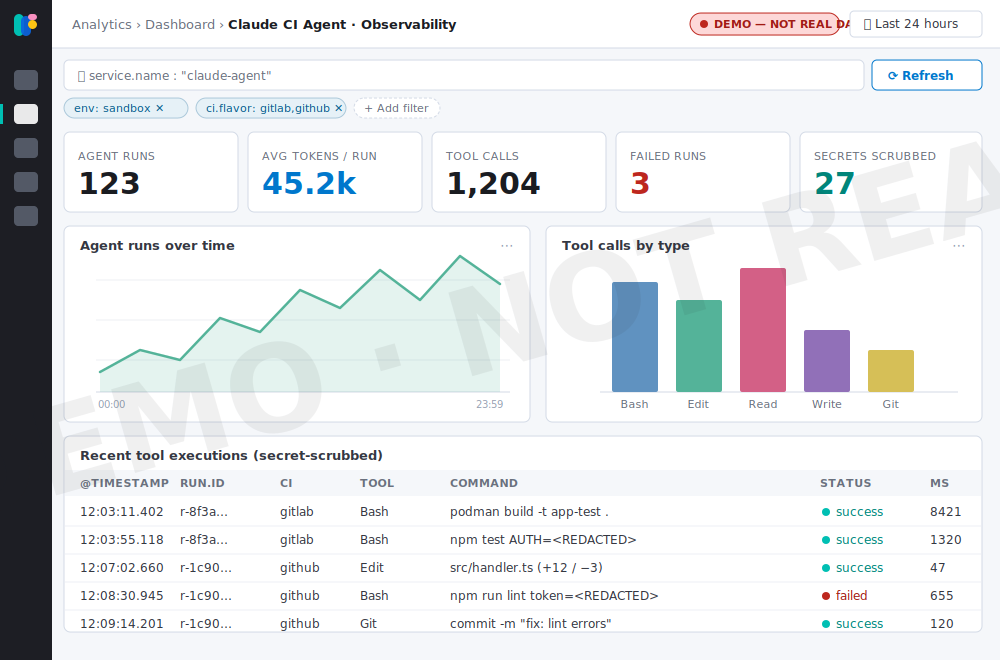

# Observability

Every command, console payload, and git mutation the agent performs is emitted as
an OTLP event through the [OTel Collector sidecar](architecture.md)— secret-scrubbed—
and stored in Elastic. From there it can be explored in a Kibana dashboard.

!!! tip "Send each team's telemetry to its own index"

    The dashboard and the OTLP receiver don't choose where data lands— the
    **exporter** does, from a `team.name` routing key the run carries. Give each
    DevOps/SRE team its own `claude-agent-<team>-*` indices (and RBAC) by deploying
    a [collector per team](team-routing.md), or by routing on the attribute in one
    shared collector. Set `OTEL_TEAM` on the pipeline to tag the run.

## Dashboard sketch

!!! warning "This is a mockup, not a real dashboard"

    The image below is a **styled mockup** in the Kibana look-and-feel, to show
    *what kind of* panels a Claude CI Agent dashboard could surface. Every number,
    chart, and table row is fabricated— it is **not** a screenshot of a live Kibana
    view and contains no real data (hence the "DEMO— NOT REAL DATA" badge).

{ loading=lazy }

## Panels we'd expect

- **KPI tiles**— agent runs, average tokens per run, total tool calls, failed
  runs, and secrets scrubbed.
- **Agent runs over time**— run volume across the selected time range.
- **Tool calls by type**— distribution across `Bash`, `Edit`, `Read`, `Write`, `Git`.
- **Recent tool executions**— a secret-scrubbed audit table (time, run id, CI
  flavor, tool, command, status, duration).

Filters across the top (time range, environment, CI flavor, service) scope every
panel— the same OTLP attributes the collector already attaches to each event.

## Per-run cost

Each run reports **how much it cost in Anthropic API usage**, taken from the
authoritative `total_cost_usd` in Claude's JSON result by
[`otel/emit_cost.py`](https://github.com/bigg01/claude-ci-agent/blob/main/otel/emit_cost.py).
The cost is surfaced three ways:

- **In the job log**— a line like
  `💰 this run cost $0.4231 in Anthropic API usage · claude-sonnet-4-6 · 2 turns · 45,200 tokens · 1.5s`
  (shown even when the collector is unreachable).
- **In the GitHub Actions run summary**— a "Claude run cost" table on the job page.
- **As an OTel metric**— `cicd.claude.run.cost_usd` (plus `…run.duration_ms` and
  `…run.tokens` by type), tagged with CI/VCS attributes so cost is attributable per
  pipeline, branch, and personality in Elastic. Every datapoint also carries
  **`claude.model`** (the model that actually served the run) and
  **`git.commit.sha`** / `git.commit.short` (the commit the run produced)— so you
  can answer "which model and which commit" for any run.

!!! note "Client-side estimate"

    `total_cost_usd` is Claude Code's own estimate of the run's cost. It is ideal
    for trend/attribution dashboards; reconcile against your Anthropic billing for
    authoritative figures.
