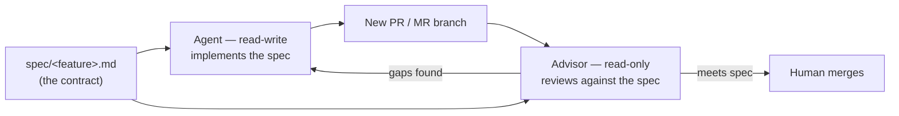
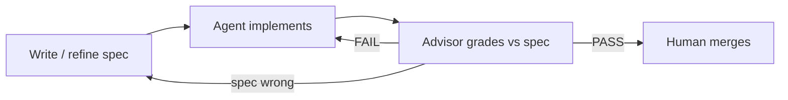
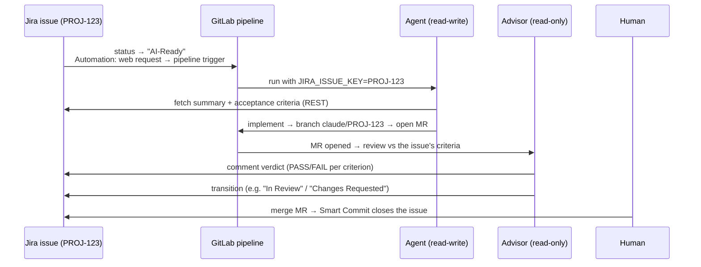

# Spec-driven development in CI

The agent is at its best when a **written specification**— not a vague comment—
is the source of truth. You describe *what* to build and *how it will be judged*;
the agent implements against that spec, and a second, independent agent reviews the
result against the same spec. The spec is the contract both sides are held to.



## Why a spec

- **Reviewable intent.** A spec is diffable and versioned— changes to *what we
  want* show up in history next to changes to *what we built*.
- **An objective bar.** The Advisor reviews against acceptance criteria you wrote,
  not against its own taste— so "looks fine to me" becomes "meets / misses spec
  item 3".
- **Separation of duties.** The Agent that writes the code never decides whether it
  passes— a different run (ideally a [different model or vendor](llm-gateway.md#different-models-or-vendors-for-creation-vs-review))
  judges it.

## 1. Write the spec

Keep specs in the repo so they are versioned, reviewed, and reachable by the agent.
A simple convention is one file per feature under `spec/`. The spec can be authored
by hand— or generated from a **Jira issue's** acceptance criteria when Jira is your
tracker (see [Triggering from Jira](#triggering-from-jira-with-gitlab) below).

The runnable GitLab example in
[`examples/gitlab/claude-ci-agent-test/`](https://github.com/bigg01/claude-ci-agent/tree/main/examples/gitlab/claude-ci-agent-test)
ships this [`spec/feature01.md`](https://github.com/bigg01/claude-ci-agent/blob/main/examples/gitlab/claude-ci-agent-test/spec/feature01.md)
— a small, self-contained feature whose criteria are concrete enough for the
Advisor to grade pass/fail:

```markdown
# spec/feature01.md — IP Config Scraper

## Goal
A single-file Python script that fetches IP / network config from a URL
(e.g. https://httpbin.org/ip) and pretty-prints the result.

## Acceptance criteria
- [ ] A single script fetches a target URL, defaulting to a reliable JSON IP API.
- [ ] The target URL is overridable via a command-line argument.
- [ ] JSON responses are pretty-printed; non-JSON responses are printed as text.
- [ ] Timeouts, network failures, and invalid JSON exit non-zero with a clear
      error — no traceback.
- [ ] Dependencies are declared inline via PEP 723 so `uv run` needs no install.
- [ ] A unit test covers a success and a failure path, with the network mocked.

## Out of scope
- Persisting results; concurrent/async fetching; any web server.

## Constraints
- Follow CLAUDE.MD coding standards. No third-party dependencies beyond `httpx`.
```

!!! tip "Acceptance criteria are the review rubric"

    Write them as checkboxes the Advisor can tick off one by one. Vague goals give
    vague reviews; testable criteria give a pass/fail verdict.

## 2. Implement from the spec (Agent personality)

Trigger the **read-write** [Agent](ci-versions.md#personalities-triggers) and point
its task at the spec file rather than describing the work inline. This is exactly
what the example's [`.gitlab-ci.yml`](https://github.com/bigg01/claude-ci-agent/blob/main/examples/gitlab/claude-ci-agent-test/.gitlab-ci.yml)
does — the `prompt` names the spec, and a `rules:` override gates the agent behind
a **manual** click so it only runs when you ask:

```yaml
include:
  - component: $CI_SERVER_FQDN/<group>/claude-ci-agent/claude-agent@v0.1.0-alpha.6
    inputs:
      prompt: >-
        Implement the specification in spec/feature01.md exactly. Satisfy every
        acceptance criterion, add the tests it requires, and follow CLAUDE.MD.
        Do not implement anything listed under "Out of scope".
      model: "claude-sonnet-4-6"

# Gate the implementer behind a manual click (omit to run it automatically).
claude-agent:
  rules:
    - when: manual
      allow_failure: false
```

The Agent runs `claude` inside a fresh rootless-Podman sandbox off the pinned image
(only the working tree is mounted in), makes atomic commits, and opens a **new
branch / MR**— it never pushes to the default branch (see
[Personalities & triggers](ci-versions.md#personalities-triggers)). The same
`prompt` input works for the [GitHub Action](ci-versions.md#github-actions-using-the-claude-ci-agent-action)
if GitHub is your SCM.

## 3. Review against the spec (Advisor personality)

The component already ships a `claude-advisor` that auto-runs on every merge
request. When you want to grade specifically **against the spec** — and on a
cheaper model than the implementer — define a custom advisor job. The example does
exactly this: it `extends: .claude-base` (the component's hidden template that
resolves secrets, starts the OTel sidecar, and defines the `claude_in_sandbox`
helper) and supplies a spec-graded prompt:

```yaml
claude-agent-advisor:
  extends: .claude-base          # inherits secret setup + claude_in_sandbox
  variables:
    CLAUDE_MODEL: "claude-haiku-4-5"   # cheaper/faster reviewer than the agent
  script:
    - |
      claude_in_sandbox -p "You are the ADVISOR (read-only). Review this change \
      against spec/feature01.md. For EACH acceptance criterion, state PASS or FAIL \
      with file:line evidence. Run the tests and linters. List any criterion not \
      met, any out-of-scope work, and any CLAUDE.MD violations. Write the verdict \
      to review.md. You MUST NOT modify, commit, or push any files." \
        --model "$CLAUDE_MODEL" --dangerously-skip-permissions \
        --output-format json > claude-result.json
    - test -f review.md || echo "Advisor produced no review.md." > review.md
    - cat review.md
  artifacts: { when: always, paths: [review.md] }
  rules:
    - when: manual
```

!!! warning "`$[[ inputs.* ]]` only interpolates inside the component"

    Component-input interpolation (e.g. `$[[ inputs.claude_args ]]`) works **only**
    within the component template itself, not in your consuming `.gitlab-ci.yml`.
    Used here it would reach the CLI verbatim and fail the job — pass a literal
    flag instead. This is the one gotcha the example exists to demonstrate.

Because the Advisor holds **no write token**, it cannot "fix and approve" its own
finding— it can only report. The verdict lands in `review.md` (artifact) and, for
the built-in `claude-advisor`, as an MR note; the per-run cost lands in
[telemetry](observability.md#per-run-cost).

!!! tip "Independent reviewer"

    Run the Advisor on a *different* model or vendor than the Agent so the reviewer
    doesn't share the implementer's blind spots. See
    [Different models for creation vs review](llm-gateway.md#different-models-or-vendors-for-creation-vs-review).

## 4. Close the loop

The review feeds back into the same spec-driven cycle:

1. **Advisor reports FAIL on a criterion** → comment `@claude address review.md
   findings for spec/feature01.md` to re-trigger the Agent on the existing branch.
2. **Spec was wrong, not the code** → edit `spec/feature01.md`, and both the next
   implementation and the next review track the change automatically.
3. **All criteria PASS** → a human merges. The agent never self-approves a merge.



## The whole loop as one `include:` (GitLab)

Because the [component](ci-versions.md#gitlab-ci-using-the-claude-agent-component)
ships **both personalities**, the minimal spec-driven loop is a single `include:` —
no hand-written advisor/agent jobs. The `claude-advisor` job auto-runs on every
merge request; the `claude-agent` job runs whenever you hand it a task:

```yaml
stages:
  - test

include:
  - component: $CI_SERVER_FQDN/<group>/claude-ci-agent/claude-agent@v0.1.0-alpha.6
    inputs:
      # The AGENT implements this spec on a new branch + MR. Runs only when this
      # is non-empty (or a CLAUDE_TASK pipeline variable is supplied ad-hoc).
      prompt: >-
        Implement the specification in spec/feature01.md exactly. Satisfy every
        acceptance criterion, add the tests it requires, and follow CLAUDE.MD.
        Do not implement anything listed under "Out of scope".
      # Independent reviewer: grade with a different model than the agent writes with.
      model: "claude-sonnet-4-6"
```

!!! example "Runnable example — start here"

    The copy-paste consuming project in
    [`examples/gitlab/claude-ci-agent-test/`](https://github.com/bigg01/claude-ci-agent/tree/main/examples/gitlab/claude-ci-agent-test)
    is this include **plus** the two customizations from the steps above: it gates
    `claude-agent` behind a manual click and adds a spec-graded `claude-agent-advisor`
    on a cheaper model. Its [`spec/feature01.md`](https://github.com/bigg01/claude-ci-agent/blob/main/examples/gitlab/claude-ci-agent-test/spec/feature01.md)
    is a real, gradeable feature — clone it into a GitLab project, set the two
    variables below, and click the job. See its README to run it.

What you get from the one include:

| Job | Runs when | Does |
| --- | --- | --- |
| `claude-agent` | `prompt` (or `$CLAUDE_TASK`) is non-empty | Implements `spec/feature01.md`, commits, opens a **new MR** |
| `claude-advisor` | the resulting **merge request** opens / updates | Grades the diff against the spec, posts the verdict as an **MR note** |

**Required CI/CD variables** (Settings → CI/CD → Variables; mask + protect):
`ANTHROPIC_API_KEY` and a `GITLAB_TOKEN` with `api` scope (the agent uses it to
push the branch and open the MR; the advisor uses it to post the note). Set
`ELASTIC_OTLP_ENDPOINT` / `ELASTIC_OTLP_AUTHORIZATION` to stream the
[per-run cost](observability.md#per-run-cost) and secret-scrubbed audit trail to
Elastic.

!!! tip "Grade the advisor against the spec, not in the abstract"

    The component's advisor prompt already says "review against the repository's
    conventions"; for a spec-graded verdict, keep the spec file in the repo (the
    advisor reads the working tree) and reference it by name in your acceptance
    criteria. To customize the advisor's wording further, fork the component or use
    the hand-written jobs shown under [Triggering from Jira](#triggering-from-jira-with-gitlab).

## Triggering from Jira (with GitLab)

When GitLab is your SCM and **Jira** is your tracker, the **Jira issue is the
spec**— its description and acceptance criteria are the contract— and the issue's
**status drives the loop**. Moving a ticket to an "AI-Ready" state kicks off the
Agent; the Advisor's verdict flows back onto the ticket. Nothing new is needed in
the agent itself— only a trigger and two small API calls.



### 1. Jira side— fire on a status change

Add a **Jira Automation** rule: *When* issue transitions to `AI-Ready` (or gets a
`claude` label), *Then* **Send web request** to GitLab's
[pipeline-trigger API](https://docs.gitlab.com/ee/ci/triggers/), passing the issue
key as a variable:

```text
POST https://gitlab.example.com/api/v4/projects/<PROJECT_ID>/trigger/pipeline
form-encoded:
  token = {{ GitLab trigger token }}          # store in Jira's secret, not inline
  ref   = main
  variables[JIRA_ISSUE_KEY] = {{ issue.key }}
  variables[CLAUDE_TASK]    = Implement {{ issue.key }} from its acceptance criteria
```

`CLAUDE_TASK` makes the existing [Agent job](ci-versions.md#personalities-triggers)
rule (`if: $CLAUDE_TASK`) match— no pipeline change required to start.

### 2. GitLab side— materialize the spec and link back

In the Agent job, turn the Jira issue into the in-repo spec the loop already
expects, then name the branch with the issue key so GitLab's
[Jira integration](https://docs.gitlab.com/ee/integration/jira/) auto-links the MR
to the ticket:

```yaml
script:
  # Pull the issue → spec/<KEY>.md (JIRA_URL/JIRA_TOKEN from CI vars or OpenBao).
  # Jira Cloud returns the description as ADF (JSON); flatten its text nodes.
  - |
    curl -sS -H "Authorization: Bearer $JIRA_TOKEN" \
      "$JIRA_URL/rest/api/3/issue/$JIRA_ISSUE_KEY?fields=summary,description" \
      | python3 -c '
    import sys, json
    d = json.load(sys.stdin)["fields"]
    def text(node):
        if isinstance(node, dict):
            return node.get("text", "") + "".join(text(c) for c in node.get("content", []))
        return "".join(text(c) for c in node) if isinstance(node, list) else ""
    print("# %s\n\n%s" % (d["summary"], text(d.get("description") or {})))
    ' > "spec/$JIRA_ISSUE_KEY.md"
  - |
    claude -p "Implement spec/$JIRA_ISSUE_KEY.md exactly. Satisfy every acceptance \
    criterion, add the tests it requires, follow CLAUDE.MD." \
      --model "$CLAUDE_MODEL" --permission-mode bypassPermissions \
      --dangerously-skip-permissions
  # Branch + MR carry the issue key so Jira and GitLab cross-link automatically.
  - |
    git push "https://oauth2:${GIT_PUSH_TOKEN}@${CI_SERVER_HOST}/${CI_PROJECT_PATH}.git" \
      "HEAD:claude/${JIRA_ISSUE_KEY}" \
      -o merge_request.create \
      -o merge_request.title="${JIRA_ISSUE_KEY} implement from spec"
```

### 3. Report the verdict back onto the ticket

When the Advisor finishes its review (MR-open trigger), post the verdict to the
issue and move it— so the loop is visible to non-engineers in Jira, not just in
GitLab:

```yaml
# In the Advisor job, after review.md is written:
- |
  jq -Rs '{body: {type:"doc", version:1, content:[{type:"paragraph",
    content:[{type:"text", text: .}]}]}}' review.md \
    | curl -sS -X POST -H "Authorization: Bearer $JIRA_TOKEN" \
        -H "Content-Type: application/json" \
        "$JIRA_URL/rest/api/3/issue/$JIRA_ISSUE_KEY/comment" -d @-
# …and transition, e.g. PASS → "In Review", FAIL → "Changes Requested":
- |
  curl -sS -X POST -H "Authorization: Bearer $JIRA_TOKEN" \
    -H "Content-Type: application/json" \
    "$JIRA_URL/rest/api/3/issue/$JIRA_ISSUE_KEY/transitions" \
    -d "{\"transition\":{\"id\":\"$JIRA_TRANSITION_ID\"}}"
```

### How the loop closes through Jira

- **FAIL** → the Advisor's comment lands on `PROJ-123`; a reviewer (or a follow-up
  `@claude` comment) re-triggers the Agent on the same branch. The ticket sits in
  "Changes Requested" until the next review passes.
- **Spec wrong, not the code** → edit the issue's acceptance criteria and move it
  back to `AI-Ready`; the regenerated `spec/PROJ-123.md` tracks the change.
- **PASS** → a human merges the MR. A [Smart Commit](https://support.atlassian.com/jira-software-cloud/docs/process-issues-with-smart-commits/)
  (`PROJ-123 #close`) in the merge transitions the issue to Done— the agent never
  self-merges or self-closes.

!!! note "Credentials stay zero-trust"

    The GitLab **trigger token** is scoped to one project; the **Jira API token**
    and `GIT_PUSH_TOKEN` come from CI variables or, better, the
    [OpenBao addon](secrets-openbao.md) at run time— nothing long-lived is baked
    into Jira or the pipeline. The read-only Advisor gets the Jira token to comment
    but **no** `GIT_PUSH_TOKEN`, so it still cannot change code.

## Guardrails that make this safe

- **The spec is in the repo**, so every run sees the same contract and its history.
- **Separation of duties**— writer and reviewer are different runs with different
  tokens; only the writer can change code, only humans can merge.
- **Everything is audited.** Each implement/review run streams secret-scrubbed
  OTLP events— and its [Anthropic cost](observability.md#per-run-cost)— to Elastic,
  so spec-driven work is fully attributable per feature, branch, and personality.
- **Bypass-permissions stays safe** because the agent runs
  [fully contained](yolo-mode.md)— the spec loop never lowers the sandbox boundary.
